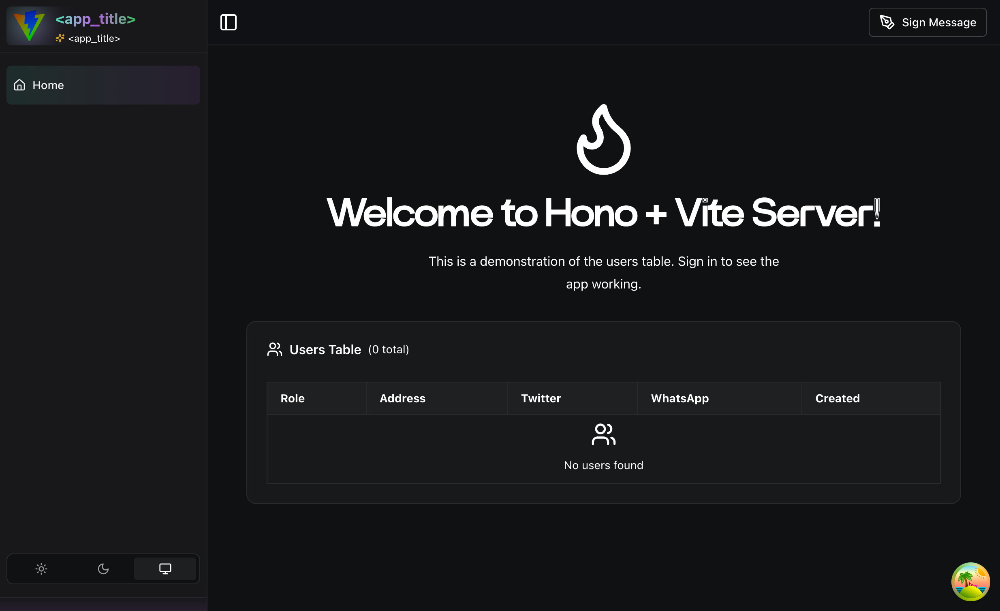
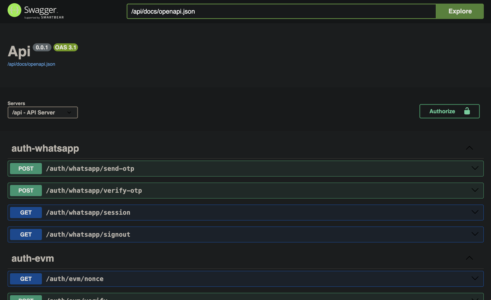

# 🚀 Hono + React Full-Stack Template

<div align="center">
  
  
  <p align="center">
    <strong>Lightning-fast full-stack web application template</strong>
  </p>

  <p align="center">
    Built with Hono.js, React, Bun runtime, and MongoDB
  </p>

  <p align="center">
    <a href="#-features">Features</a> •
    <a href="#-screenshots">Screenshots</a> •
    <a href="#-tech-stack">Tech Stack</a> •
    <a href="#-quick-start">Quick Start</a> •
    <a href="#-api-documentation">API Docs</a> •
    <a href="#-deployment">Deployment</a>
  </p>
</div>

---

## ✨ Features

<table>
<tr>
<td width="50%">

### 🎯 Core Features

- ⚡ **Unified Development** - Single command runs both frontend & backend
- 🏃 **Ultra-fast Performance** - Powered by Bun runtime
- 🔐 **Multi-Auth System** - EVM, WhatsApp OTP, and Twitter/X OAuth
- 📊 **Real-time Dashboard** - Live user management interface
- 🐳 **Production Ready** - Docker support with multi-stage builds
- 📅 **Job Scheduling** - Built-in Pulse scheduler for background tasks

</td>
<td width="50%">

### 🛠️ Developer Experience

- 📚 **Auto-generated API Docs** - Swagger UI powered by Effect
- 🎨 **Beautiful UI Library** - Complete shadcn/ui components
- 📝 **Type Safety** - Full TypeScript support
- 🔄 **Hot Reload** - Instant feedback during development
- ✅ **Code Quality** - ESLint, Prettier, and Husky pre-configured

</td>
</tr>
</table>

## 📸 Screenshots

<table>
<tr>
<td align="center">
  
  <p><b>Landing Page</b></p>
  <sub>Modern, responsive dashboard interface</sub>
</td>
</tr>
<tr>
<td align="center">
  
  <p><b>API Documentation</b></p>
  <sub>Auto-generated Swagger UI with interactive API testing</sub>
</td>
</tr>
</table>

## 🔧 Tech Stack

<table>
<tr>
<td align="center" width="96">
  <br>
  <b>Bun</b><br>
  <sub>Runtime</sub>
</td>
<td align="center" width="96">
  <br>
  <b>Hono.js</b><br>
  <sub>Backend</sub>
</td>
<td align="center" width="96">
  <br>
  <b>React</b><br>
  <sub>Frontend</sub>
</td>
<td align="center" width="96">
  <br>
  <b>MongoDB</b><br>
  <sub>Database</sub>
</td>
<td align="center" width="96">
  <br>
  <b>TypeScript</b><br>
  <sub>Language</sub>
</td>
</tr>
<tr>
<td align="center" width="96">
  <br>
  <b>Vite</b><br>
  <sub>Build Tool</sub>
</td>
<td align="center" width="96">
  <br>
  <b>TanStack</b><br>
  <sub>Router</sub>
</td>
<td align="center" width="96">
  <br>
  <b>Tailwind</b><br>
  <sub>Styling</sub>
</td>
<td align="center" width="96">
  <br>
  <b>shadcn/ui</b><br>
  <sub>Components</sub>
</td>
<td align="center" width="96">
  <br>
  <b>Effect</b><br>
  <sub>Schema & Docs</sub>
</td>
</tr>
<tr>
<td align="center" width="96">
  <br>
  <b>Pulse</b><br>
  <sub>Job Scheduler</sub>
</td>
</tr>
</table>

## 📅 Job Scheduling with Pulse

This template includes [Pulse](https://docs-pulse.pulsecron.com/), a MongoDB-backed job scheduler that automatically manages job persistence and execution.

### Key Features

- 🔄 **Self-managed schemas** - Pulse handles all database schemas automatically
- 💾 **Persistent jobs** - Jobs survive server restarts and resume automatically
- 🔁 **Retry mechanisms** - Built-in retry logic with exponential and fixed backoff
- ⚡ **Concurrency control** - Limit how many jobs run simultaneously
- 📊 **Event-driven** - React to job lifecycle events (start, success, fail)

### Job Management

All jobs are defined in the `/src/jobs` directory. Check out:

- 🔧 `/src/jobs/example-jobs.ts` - Example implementations
- 📝 `/src/jobs/index.ts` - Main job initialization

Jobs are automatically initialized on server startup and gracefully shut down on termination.

## 🚀 Quick Start

### Prerequisites

- **Bun** (latest version) - [Install Bun](https://bun.sh)
- **MongoDB** instance (local or cloud) - Required for database and Pulse job scheduling
- **AWS S3** bucket (for file storage)

### 1️⃣ Clone & Install

```bash
# Clone the repository
git clone https://github.com/mguleryuz/hono.git
cd hono

# Install dependencies
bun i
```

### 2️⃣ Setup Project Metadata

Set up your project name and metadata:

```bash
bun setup
```

This interactive script will help you configure:

- **Project name** - NPM package name for your project
- **App title** - Display name used in the UI
- **Page title** - Browser tab title
- **Description** - Project description for SEO
- **Keywords** - SEO keywords
- **Open Graph metadata** - For social media sharing
- **Twitter Card metadata** - For Twitter/X sharing

The script will automatically update all placeholder values throughout the project.

### 3️⃣ Configure Environment

Copy and configure your environment variables:

```bash
cp .env.example .env
```

📝 **Note**: Check `.env.example` for all required environment variables and their descriptions.

💡 **Pulse Note**: The job scheduler will automatically create a `pulseJobs` collection in your MongoDB database on first run.

### 4️⃣ Start Development

```bash
# Start both frontend and backend (port 8080)
bun dev
```

🎉 **That's it!** Visit [http://localhost:8080](http://localhost:8080)

## 📁 Project Architecture

```
hono/
├── README.md                      # This file
├── package.json                   # Package JSON file
├── bun.lock                       # Bun lock file
├── Dockerfile                     # Docker build file
├── commitlint.config.mjs          # Commitlint config file
├── components.json                # Components JSON file
├── docker.sh                      # Docker script
├── eslint.config.mjs              # ESLint config file
└── tsconfig.json                  # TypeScript config file
├── client                         # Client directory
│   ├── index.html                 # Client index file
│   ├── postcss.config.mjs         # Postcss config file
│   ├── public/                    # Public directory
│   │   ├── fonts/                 # Fonts
│   │   └── images/                # Images
│   ├── src/                       # Client source directory
│   │   ├── components/            # Components
│   │   │   ├── ui/                # UI components
│   │   ├── hooks/                 # Hooks
│   │   ├── main.tsx               # Main file
│   │   ├── providers/             # Providers
│   │   ├── routeTree.gen.ts       # Route tree generator
│   │   ├── routes/                # Routes
│   │   ├── styles/                # Styles
│   │   └── utils/                 # Utils
│   └── vite.config.ts             # Vite config file
├── logs/                          # Logs
├── scripts/                       # Scripts
├── src/                           # Server source directory
│   ├── api.ts                     # API file
│   ├── index.ts                   # Index file
│   ├── jobs/                      # Jobs (Pulse scheduler)
│   │   ├── index.ts               # Job initialization
│   │   ├── example-jobs.ts        # Example job definitions
│   │   └── README.md              # Job documentation
│   ├── mongo/                     # MongoDB
│   │   ├── helpers/               # Helpers
│   │   │   ├── model-change-listener.ts    # Mongo Streams Listener
│   │   │   └── pulse.ts           # Pulse job scheduler config
│   ├── routes/                    # Routes
│   ├── schemas/                   # Schemas
│   ├── services/                  # Services
│   ├── types/                     # Types
│   └── utils/                     # Utils
│       └── server/                # Server utils
├── static/                        # Static files
├── tests/                         # Tests
```

## 🔌 API Documentation

The API is automatically documented with Swagger UI powered by Effect schemas.

🔗 **Access Complete API Documentation**: [http://localhost:8080/api/docs](http://localhost:8080/api/docs)

The interactive Swagger UI provides:

- Complete list of all API endpoints
- Request/response schemas
- Authentication requirements
- Try-it-out functionality

## 🎨 UI Components

This template includes a complete shadcn/ui component library:

<details>
<summary><b>View all components</b></summary>

- **Layout**: Sidebar, Header, Footer
- **Forms**: Input, Select, Checkbox, Radio, Switch
- **Buttons**: Button, IconButton, ToggleGroup
- **Feedback**: Alert, Toast, Progress, Spinner
- **Overlay**: Dialog, Sheet, Popover, Tooltip
- **Data**: Table, Card, Badge, Avatar
- **Navigation**: Tabs, Breadcrumb, Pagination
- **Utilities**: ThemeSwitcher, CopyableAddress

</details>

## 🔐 Authentication Methods

<table>
<tr>
<td width="33%">

### 🦊 EVM Wallet

Connect with MetaMask or any Web3 wallet using RainbowKit

</td>
<td width="33%">

### 📱 WhatsApp

Secure OTP-based authentication via WhatsApp Business API

</td>
<td width="33%">

### 🐦 Twitter/X

OAuth 2.0 integration for Twitter/X platform login

</td>
</tr>
</table>

## 🐳 Docker Deployment

```bash
# Build and run with Docker script
bun docker
```

## 🔄 Release Flow

This project follows [Conventional Commits](https://www.conventionalcommits.org/) and uses [Standard Version](https://github.com/conventional-changelog/standard-version) for automated versioning and changelog generation.

### Release Commands

```bash
# Create a new release
bun release

# Create a pre-release
bun release:alpha  # Alpha release
bun release:beta   # Beta release

# Push release to origin
bun release:pub
```

### Release Process

1. **Commit Changes** - Use conventional commit messages:
   - `feat:` New features (minor version bump)
   - `fix:` Bug fixes (patch version bump)
   - `BREAKING CHANGE:` Breaking changes (major version bump)

2. **Create Release** - Run `bun release` to:
   - Bump version in package.json
   - Generate/update CHANGELOG.md
   - Create a git tag

3. **Publish** - Run `bun release:pub` to push tags and trigger CI/CD

## ☁️ AWS Deployment

### GitHub Actions Setup

1. **Add GitHub Secrets**:
   - `AWS_ACCESS_KEY_ID`
   - `AWS_SECRET_ACCESS_KEY`

2. **Add GitHub Variables**:
   - `AWS_REGION`

3. **Push to main branch** - GitHub Actions will automatically build and deploy to AWS ECR

## 🤝 Contributing

We love contributions! Please see our [Contributing Guide](CONTRIBUTING.md) for details.

<table>
<tr>
<td align="center">
<sub>Made with ❤️ by</sub><br>
<a href="https://github.com/mguleryuz">mguleryuz</a>
</td>
</tr>
</table>

## 📄 License

This project is licensed under the MIT License - see the [LICENSE](LICENSE) file for details.

---

<div align="center">
  <sub>Built with ⚡ Bun and 🔥 Hono</sub>
</div>
